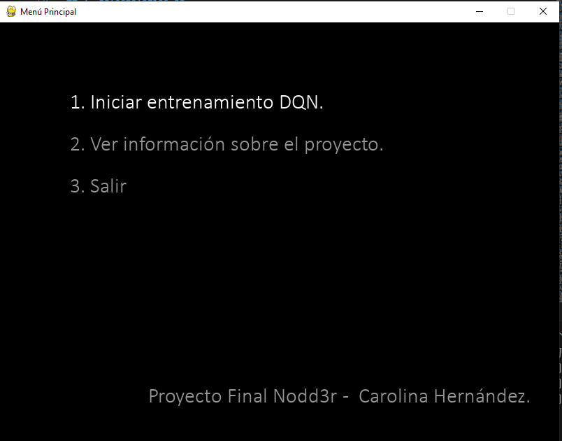
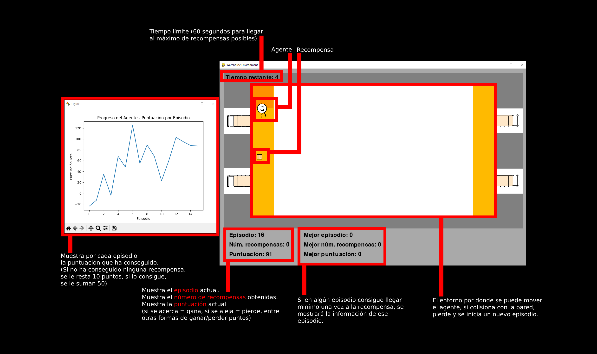

# **Proyecto Deep Reinforcement Learning - Optimización de rutas.**

## **Índice**
1. [Problema.](#1-problema)
2. [Idea.](#2-idea)
3. [Tecnologías.](#3-tecnologías)
4. [Proyecto.](#4-proyecto)

## 1. **Problema.**
<small>[Volver ↥](#índice)</small>

El problema que se busca solucionar es el de **optimización de rutas**, donde el agente (robot, reparto, Uber, etcétera) encuentra el camino más eficiente del punto A al punto B.
Actualmente se resuelve con tres enfoques tradicionales: *Grafos, optimización y heurísticas.*

### **Optimización (Ejemplo: Dijkstra)**
- **Concepto**: La optimización en el contexto de rutas significa encontrar el camino más eficiente entre dos puntos en una red. Piensa en un robot que necesita llegar del punto A al punto B en un almacén: la optimización busca la forma más rápida o menos costosa de hacer ese recorrido.
- **Ejemplo conceptual**: Imagina que el robot tiene un mapa y usa un “algoritmo de optimización” como Dijkstra para saber qué camino tomar, eligiendo siempre la opción más corta en cada paso hasta llegar al destino.
- **Limitación**: Este tipo de algoritmo supone que el entorno es estático (es decir, que no cambian las rutas o las distancias), y no tiene capacidad para adaptarse a cambios imprevistos como obstáculos.

### **Heurísticas (Ejemplo: A\*)**
- **Concepto**: Una heurística es una “regla rápida” que ayuda a reducir el tiempo de búsqueda de una solución sin garantizar que sea perfecta, sino lo suficientemente buena. Este enfoque se usa cuando no es práctico o posible calcular la ruta exacta, especialmente en redes grandes o complejas.
- **Ejemplo conceptual**: El robot, en lugar de revisar todas las rutas posibles, usa una heurística, como “moverse hacia el objetivo si parece que está más cerca”, para reducir la cantidad de rutas que considera. El algoritmo A\* usa una combinación de la distancia real más una “estimación” de cuánto falta para llegar al destino, lo que le permite encontrar caminos buenos más rápido que con optimización pura.
- **Limitación**: Aunque es más rápido que Dijkstra en algunos casos, A\* aún requiere que el entorno sea relativamente estable y no se adapta a cambios en tiempo real.

### **Grafos**
- **Concepto**: Un grafo es una estructura matemática que representa elementos (llamados nodos) y sus conexiones (llamadas aristas). Los métodos basados en grafos ayudan a representar mapas de rutas o conexiones de manera que se puedan aplicar algoritmos para encontrar rutas.
- **Ejemplo conceptual**: Imagina el almacén como una serie de puntos de interés (estanterías, áreas de recogida, etc.), conectados por caminos. Cada punto es un nodo, y cada conexión es una arista. Los algoritmos de grafos, como Dijkstra o A\*, pueden entonces usarse para buscar el camino óptimo de un punto a otro en este “mapa de nodos y conexiones”.
- **Limitación**: Los grafos representan bien conexiones estáticas, pero no son dinámicos, por lo que si se bloquea una conexión, el algoritmo necesita volver a calcular todo desde cero.

## 2. **Idea.**
<small>[Volver ↥](#índice)</small>
### **DQN (Deep Q-Learning)**
- **Concepto general**: DQN es una técnica de Reinforcement Learning (RL) que permite a un agente (como un robot) aprender qué acciones debe tomar en cada situación para maximizar sus recompensas a lo largo del tiempo. A diferencia de los métodos tradicionales, DQN permite al agente aprender mediante prueba y error, explorando y mejorando con cada experiencia.

- **Cómo funciona conceptualmente**: Imagina que el robot en el almacén tiene una tabla que le dice qué tan buena es cada acción en cada posición o situación. Esta tabla se llama tabla Q y le dice al robot qué tan "recompensante" será cada acción en función de sus experiencias pasadas.

- **Ejemplo**: Si en el pasado el robot tomó una acción que le acercó a su objetivo, se guarda esa acción como "buena" en su memoria, y si tomó una acción que lo alejó, aprende a evitarla.
A medida que el robot explora más, esta tabla Q se vuelve más completa y precisa, ayudando al robot a tomar decisiones más inteligentes en el futuro.

- **¿Qué aporta el Deep Learning?**: En entornos complejos, como un almacén con muchas rutas, la tabla Q se vuelve enorme y difícil de gestionar. Aquí es donde entra el Deep Learning: en lugar de guardar cada acción posible, DQN utiliza una red neuronal para aprender patrones y estimar la tabla Q, almacenando solo la información esencial. Esto permite que el robot maneje entornos grandes y complejos, sin sobrecargar su memoria.

- **Ventajas de DQN**
  - **Adaptabilidad**: A diferencia de los métodos tradicionales de optimización o heurísticas, el DQN permite que el robot se adapte a los cambios en el entorno (como obstáculos nuevos o rutas bloqueadas) sin necesidad de volver a calcular todo desde cero.
  - **Aprendizaje continuo**: DQN permite que el robot aprenda de cada acción que toma, incluso si esa acción fue una “mala decisión”. Esto le ayuda a mejorar con cada experiencia, algo que no sucede en los enfoques tradicionales.

- **Limitaciones.**
  - **Entrenamiento intensivo**: El DQN requiere mucho entrenamiento antes de que el robot tome decisiones óptimas. En entornos complejos, el entrenamiento puede tomar tiempo y ser intensivo computacionalmente.
  - **Exploración y explotación**: DQN necesita explorar varias opciones antes de poder explotar sus conocimientos para tomar siempre las mejores decisiones. Esta fase de exploración puede llevar a que el robot tome decisiones subóptimas al inicio.

## 3. **Tecnologías.**
<small>[Volver ↥](#índice)</small>
- **Python.**
- **Pygame:** Crear mi propio entorno para utilizarlo en OpenAI GYM.
- **OpenAI GYM:** Entorno creado con pygame donde entrenar al modelo.
- **TensorFlow:** Crear una red neuronal. (Deep Learning)
- **Deep Q Network:** Algoritmo de DRL utilizado para el entrenamiento. (Deep Reinforcement Learning)

## 4. **Proyecto.**
<small>[Volver ↥](#índice)</small>
### Partes visuales del proyecto.

- **Menú principal**
  - Acceder al tutorial visual → entrenamiento.
  - Ver información de interés sobre el proyecto.
  - Salir

- **Tutorial visual de las partes visuales del proyecto.**

- ¿Qué ves en la pantalla?
  - El entorno del almacén (imagen de fondo).
  - El agente (robot) moviéndose.
  - El premio (recompensa) que debe recoger.
  - Información como: puntuación actual, mejor puntuación, número de recompensas recogidas, episodio actual y tiempo restante.

### ¿Cómo funciona el proyecto?

- **El objetivo:**
  El agente (un robot simulado) debe moverse por un entorno (el almacén) para recoger recompensas (premios) y evitar obstáculos. El agente aprende a moverse de forma inteligente usando un algoritmo llamado Deep Q-Learning (DQN).

- **¿Cómo se mueve el agente?**
  El agente puede moverse en cuatro direcciones: izquierda, derecha, arriba y abajo. Cada vez que el agente toma una acción, el entorno le dice si esa acción fue buena o mala mediante una "recompensa" (un número positivo o negativo).

- **¿Cómo gana puntos?**
  - Si el agente se acerca a la recompensa, gana puntos (+1).
  - Si el agente recoge la recompensa (llega al premio), gana muchos puntos (+50) y el premio cambia de lugar.

- **¿Cómo pierde puntos?**
  - Si el agente se aleja de la recompensa, pierde puntos (-1).
  - Si choca contra un obstáculo o se acaba el tiempo del episodio, pierde muchos puntos (-10) y el episodio termina.

- **¿Qué es un episodio?**
  Un episodio es una partida: empieza cuando el agente aparece en el entorno, tratará de coger tantas recompensas como pueda y termina cuando choca o se acaba el tiempo. Al terminar, el entorno se reinicia y el agente vuelve a intentarlo, aprendiendo de sus errores y aciertos.

- **¿Cómo aprende el agente?**
  Al principio, el agente se mueve casi al azar. Cada vez que toma una acción, guarda en su memoria si esa acción fue buena o mala según la recompensa recibida. Con el tiempo, el agente usa esa experiencia para tomar mejores decisiones y moverse de forma más eficiente hacia la recompensa.

- **Resumen visual:**
  - El agente aparece en el almacén.
  - El premio aparece en una posición aleatoria.
  - El agente se mueve para intentar recoger el premio.
  - Si lo recoge, suma puntos y el premio cambia de lugar.
  - Si choca o se acaba el tiempo, pierde puntos y el episodio termina.
  - El proceso se repite y el agente aprende a mejorar en cada intento.

### Instrucciones para ejecutarlo en local.

A continuación se explica cómo descargar y ejecutar el proyecto en tu propio ordenador, pensado para principiantes que no tienen experiencia con Git ni con la terminal:

1. **Descargar el proyecto desde GitHub (sin usar Git ni terminal)**
   - Ve a la página del repositorio en GitHub usando tu navegador web.
   - Busca el botón verde que dice "Code" y haz clic en él.
   - Selecciona la opción "Download ZIP".
   - Se descargará un archivo comprimido `.zip` con todo el proyecto.
   - Busca el archivo descargado (normalmente en la carpeta "Descargas") y haz doble clic para descomprimirlo. Se creará una carpeta con todos los archivos del proyecto.

2. **Instalar Python**
   - Si no tienes Python instalado, descárgalo desde [python.org](https://www.python.org/downloads/).
   - Instala Python siguiendo los pasos del instalador (asegúrate de marcar la casilla "Add Python to PATH" durante la instalación).
   - Para comprobar si tienes Python instalado, tienes dos opciones:
     - **Opción 1:** Abre el menú Inicio y busca "IDLE" o "Python". Si aparece, ya lo tienes instalado.
     - **Opción 2:** Abre el menú Inicio, busca y abre "cmd" (símbolo del sistema), escribe el siguiente comando y pulsa Enter:
       ```
       python --version
       ```
       - Si ves un mensaje como `Python 3.10.0` (o cualquier versión 3.x), ya tienes Python instalado.
       - Si te sale un error o no reconoce el comando, instala Python como se indica arriba.

3. **Instalar las librerías necesarias**
   - Abre el programa llamado "IDLE (Python)" o busca "cmd" (símbolo del sistema) en el menú Inicio.
   - En la ventana que se abre, navega hasta la carpeta donde descomprimiste el proyecto (puedes usar el comando `cd` para cambiar de carpeta en la terminal, o simplemente abrir la terminal en esa carpeta).
   - Escribe (o copia y pega) el siguiente comando y pulsa Enter:
     ```
     pip install -r requirements.txt
     ```
   - Esto instalará automáticamente todas las librerías necesarias para el proyecto.
   - Si te da error con `pip`, prueba con `pip3` en vez de `pip`.
   - Si no encuentras el archivo `requirements.txt`, puedes instalar las librerías principales una a una:
     ```
     pip install pygame gym tensorflow
     ```

4. **Ejecutar el proyecto**
   - En la carpeta que descomprimiste, busca el archivo llamado `main.py` (este es el archivo principal del proyecto).
   - Haz doble clic en `main.py`. Si todo está bien, se abrirá una ventana con el menú principal del proyecto.
   - Si al hacer doble clic no se abre, haz clic derecho en el archivo y selecciona "Abrir con..." y elige "Python".

5. **¡Listo!**
   - Ya puedes navegar por el menú, ver la información y ejecutar el entorno de entrenamiento.

**Notas:**
- Si tienes problemas con imágenes o rutas, asegúrate de que las carpetas y archivos estén en la ubicación correcta (no cambies la estructura de carpetas).
- Si ves una ventana negra que se cierra rápido, puede que falte alguna librería o haya un error. Intenta abrir el archivo desde IDLE (abre IDLE, ve a Archivo > Abrir, selecciona `main.py` y pulsa F5 para ejecutarlo). Así podrás ver los mensajes de error.
- Si tienes dudas, me puedes preguntar o, si prefieres algún tutorial, en YouTube puedes buscar "cómo ejecutar un archivo Python en Windows" para ver ejemplos visuales.

---

## Redes sociales y contacto

- [LinkedIn](https://www.linkedin.com/in/car-her-mer/)  

---
<small>[Volver ↥](#índice)</small>
